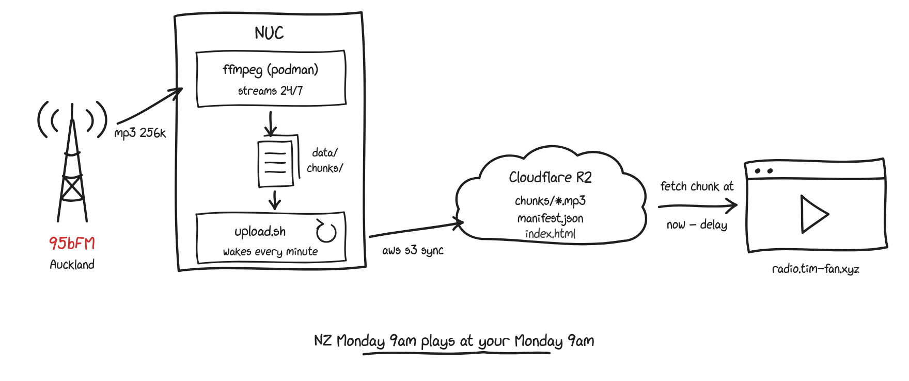

# NZ Radio Time-Shift

Continuously records 95bFM (Auckland) and replays it delayed by the
NZ↔local timezone offset, so NZ Monday 9am plays at *your* Monday 9am.

**▶ Listen: [radio.tim-fan.xyz](https://radio.tim-fan.xyz/)**

> **Note**: all repo contents — code, player, diagram, this README — were
> generated with Claude Fable 5.

<picture>
  <source media="(prefers-color-scheme: dark)" srcset="diagram-dark.png">
  
</picture>

<!-- diagram source: diagram.svg — its font stack only renders correctly on
     machines with an xkcd/comic font installed, so the README embeds
     pre-rendered PNGs instead (see repo history for the render recipe) -->


Key design points:

- **Chunk filenames are UTC** (`chunk_20260708T041500Z.mp3`). All timezone
  math lives in the player, so NZ DST transitions never make names ambiguous.
- **Segments align to clock boundaries** (`-segment_atclocktime 1`), so chunk
  start times are predictable; the manifest handles gaps and restarts.
- **The player is manifest-driven**: it fetches `manifest.json`, picks the
  chunk covering `now − delay`, seeks into it, and preloads the next chunk
  for near-gapless playback. Delay = (station UTC-offset − local UTC-offset)
  wrapped into [0, 24h), computed live via `Intl` (DST-correct on both
  ends). The wrap means you always hear the station at your own wall-clock
  time; if the station's timezone is *behind* yours, that's yesterday's
  broadcast (NZ hearing a US station's Tuesday 9am at NZ Wednesday 9am).

## Repo layout

```
capture/Containerfile, capture.sh   ffmpeg capture container (podman)
upload/upload.sh                    sync → R2, prune, manifest (aws cli)
player/index.html                   static player, lives in the bucket
deploy/*.service                    systemd units for the NUC
.env.example                        copy to .env, never commit .env
```

## 1. Cloudflare setup (once)

1. Create an R2 bucket.
2. R2 → *Manage API Tokens* → create a token with **Object Read & Write**
   scoped to the bucket. Note the Access Key ID / Secret Access Key.
3. Bucket → *Settings* → *Custom Domains* → connect a subdomain of a domain
   that's on Cloudflare (e.g. `radio.example.com`). This makes the bucket
   publicly readable at that hostname — that's both the player URL and the
   audio origin (same origin, so no CORS config needed).

## 2. NUC setup

Prereqs: `podman`, `aws` CLI, `python3`.

```bash
sudo mkdir -p /opt/radio-delay/data/chunks
sudo cp -r capture upload deploy /opt/radio-delay/
cp .env.example /opt/radio-delay/.env   # then fill in the R2_* values
chmod 600 /opt/radio-delay/.env
chmod +x /opt/radio-delay/upload/upload.sh

# build the capture image — as root, because the systemd units are system
# units, and rootful podman has a separate image store from your user's
sudo podman build -t radio-capture:latest /opt/radio-delay/capture

# install + start services
sudo cp deploy/radio-capture.service deploy/radio-upload.service /etc/systemd/system/
sudo systemctl daemon-reload
sudo systemctl enable --now radio-capture radio-upload
```

Check it's alive:

```bash
ls -la /opt/radio-delay/data/chunks/        # chunks appearing every 5 min
journalctl -u radio-capture -u radio-upload -f
```

## 3. Deploy the player

```bash
set -a; source /opt/radio-delay/.env; set +a
aws --endpoint-url "https://${R2_ACCOUNT_ID}.r2.cloudflarestorage.com" \
    s3 cp player/index.html "s3://${R2_BUCKET}/index.html" \
    --cache-control max-age=60 --content-type "text/html; charset=utf-8"
```

Then open `https://radio.example.com/`. Until the archive reaches back as
far as your delay (worst case a few minutes shy of 24 h) the player will
say nothing is recorded yet for the target time — append `?delayMinutes=2`
to the URL to listen near-live and verify the pipeline.

## Operational notes

- **Retention**: the delay is always under 24 h (whatever the timezone
  pair), so `RETENTION_HOURS=36` (`.env`) covers it with margin. The
  uploader prunes R2 itself (R2 lifecycle rules only do whole days), plus
  keeps `LOCAL_KEEP_HOURS` of local buffer.
- **Cost**: 256 kbps ≈ 2.8 GB/day → ~4.2 GB stored at 36 h. Inside R2's
  10 GB free tier; egress via custom domain is free. ~90 k class-A ops/month
  (uploads + once-a-minute manifest), free tier is 1 M.
- **If bandwidth/storage bites**: switch `STREAM_URL` to the 64 kbps AAC
  mount (`https://streams.95bfm.com/stream128`) — chunks become `.aac`
  (update the extension in `capture.sh`, `upload.sh`, and the player's
  `CHUNK_RE`). MP3 was chosen because every browser plays it natively.
- **Stream mounts** (from `https://streams.95bfm.com/status-json.xsl`):
  `/stream95` MP3 256k · `/stream128` AAC 64k · `/stream112` FLAC.
- **Gaps**: if the stream or NUC dies, chunks are simply missing; the player
  skips to the next available chunk. After a restart mid-window, the first
  chunk starts at connect time (not clock-aligned) — also handled by the
  manifest lookup.

## Why not HLS?

There *is* a standard for this shape of problem: **HLS** (HTTP Live
Streaming, RFC 8216 — and its sibling MPEG-DASH). It works exactly like
this project does — media cut into segments, listed in a playlist file,
served as static files, player walks the playlist — just with small
(2–10 s) segments, an `.m3u8` playlist instead of `manifest.json`, and a
player library (`hls.js`) instead of ~100 lines of vanilla JS. ffmpeg can
even emit HLS directly, and its playlists can carry wall-clock timestamps
(`EXT-X-PROGRAM-DATE-TIME`) with a multi-hour DVR window, which is the
timeshift feature this project needs.

It wasn't used here because, for a single listener at one fixed delay, the
bespoke version is less machinery: 288 chunks/day instead of tens of
thousands of tiny segments, no player dependency, and "seek to 9am" is
just filename arithmetic. The trade-off: chunk handover uses a plain
`<audio>` element swap, which can leave a few milliseconds of seam every
5 minutes, where an HLS player would be sample-accurate gapless. If that
ever matters, the capture side converts to real HLS with a one-line ffmpeg
change.

## Related

Prior art for timezone-shifted radio — same itch, different scratches:

- [DelayPlayer](https://frisnit.com/delayplayer-radio-4-synced-to-your-timezone/) —
  the closest spiritual ancestor: BBC Radio 4 kept in a rolling 24 h buffer
  and re-served as live streams synced to various world timezones.
- [autopo.st Stream Timeshift](https://www.autopo.st/stream-delay/) — a paid
  service that delays any stream and feeds it back to your own
  Icecast/Shoutcast server, but caps out at 3 h — well short of the
  up-to-24 h needed here.
- Expats have been asking for this for years
  ([Tom's Guide](https://forums.tomsguide.com/threads/delaying-internet-radio.309901/),
  [British Expats](https://britishexpats.com/forum/usa-57/there-any-way-listen-bbc-radio-time-shifted-my-time-zone-917134/),
  [NextPVR](https://forums.nextpvr.com/showthread.php?tid=64808&page=4)),
  usually answered with "record it and listen later."

What seems new here: serverless playback straight from object storage, with a
static page doing the timezone math — nothing runs at listen time.
